# Writing Your First Custom Alexa Skill

This guide will walk you through the steps to create your first custom Alexa skill using Python programming language and the Alexa web-based console.

## 1. Create an Alexa Developer Account

1. Go to the [Amazon Developer Portal](https://developer.amazon.com/) and sign in with your Amazon account credentials.
2. Click on the "Alexa" tab and then click on "Get Started" under the "Alexa Skills Kit" section or navigate to this [URL](https://developer.amazon.com/en-US/alexa/alexa-skills-kit/start)
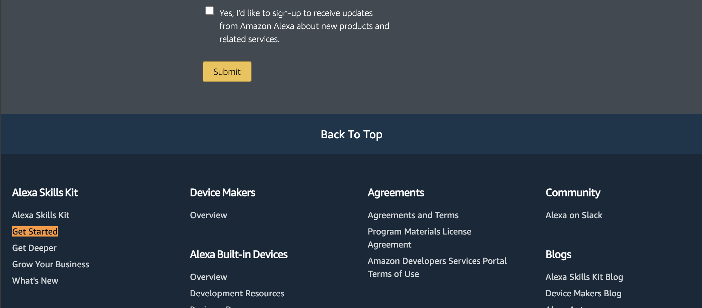
3. Follow the instructions to create a new developer account or sign in if you already have one.
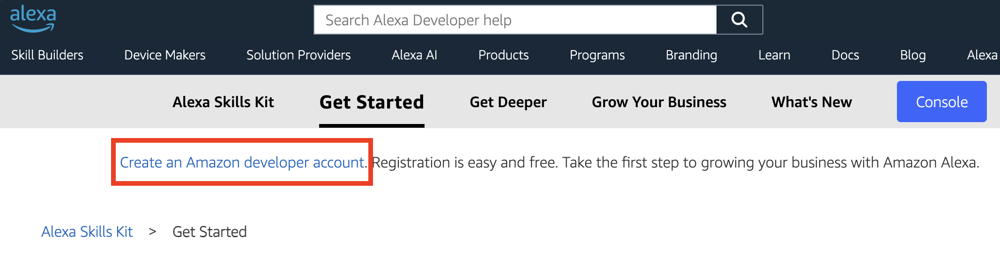

## 2. Create Your First Alexa Hosted Custom Skill
1. In the [Alexa Developer Console](https://developer.amazon.com/alexa/console/ask), click on the "Create Skill" button.
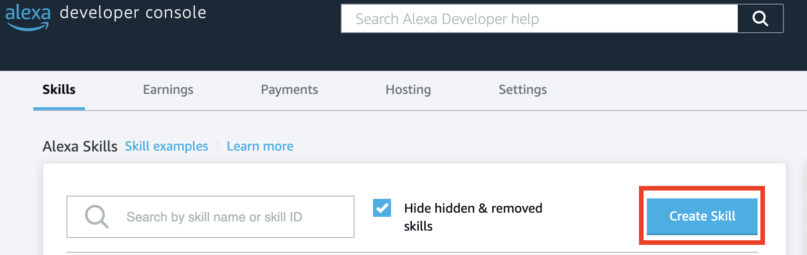
3. On the "Skill Information" page, provide a name for your skill (e.g., "My First Skill").
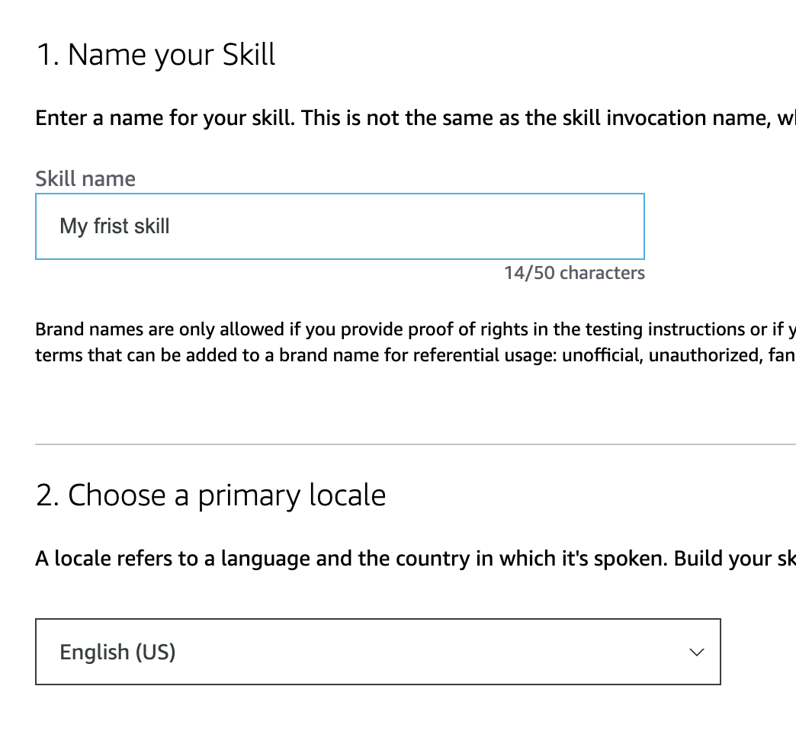
2. Click "Next" to go to "Experience, Model, Hosting service" panel.
    1. Choose a type of experience - set to **"Other"**.
    2. Choose a model - set to **"Custom"**.
    3. Hosting services - set to **"Alexa-hosted (Python)"**.
5. Click "Next" to go to "Templates" panel and choose **"Import Skill"** and paste the following URL there "https://github.com/najczuk/alexa-co-2024.git".
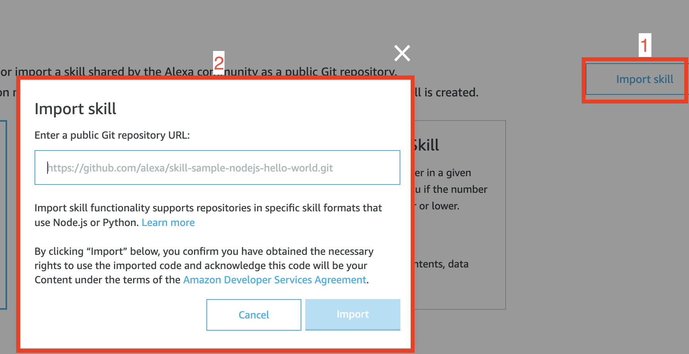
6. After the skill is imported and built, you will be redirected to Alexa Build Console.
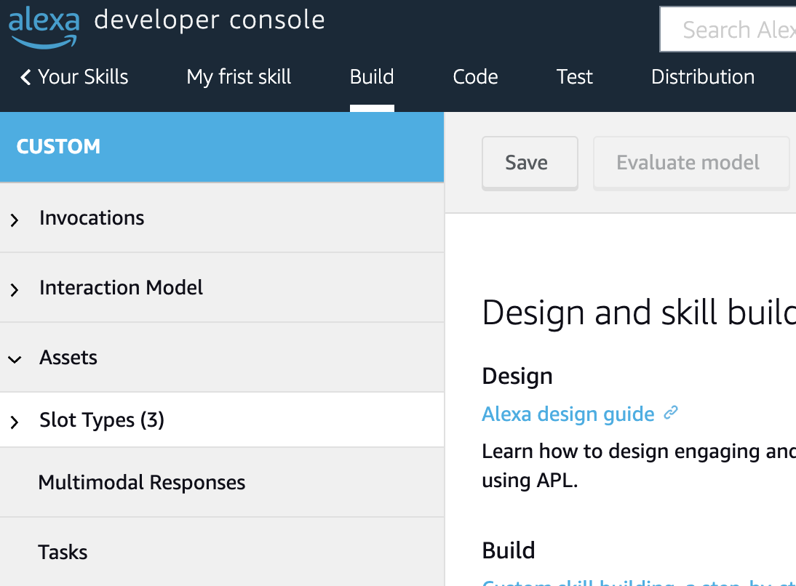
7. Navigate to **"Test"** tab and choose "Development" in the very first dropdown field.
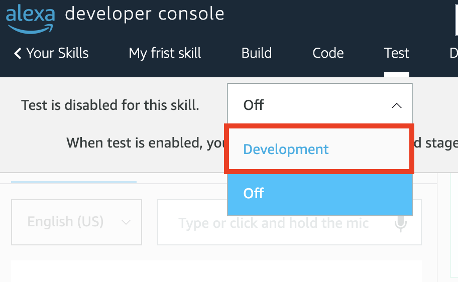
8. Now you can interact with the sample quiz skill.
    1. Say or write "teach me" to start your custom skill.
    2. Say or write "start a quiz" to start a... quiz.
    3. You can answer the questions and the skill will tell you whether the answer is good or bad.
    4. Say stop to "stop" the skill.
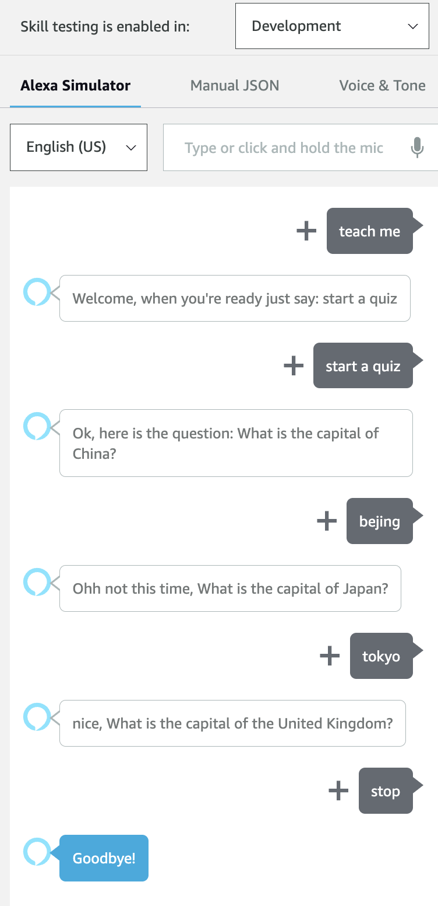

## 3. Explore the Invocation Name

1. In the "Build" tab, under "Interaction Model" section on the left, click on the "Invocations" tab.
2. You can switch the Skill Invocation Name from "teach me" to something else and test whether it works.
3. Click "Save Model" and then "Build Model", wait for deployment.
4. Go back to "Test" tab and check if it works.

## 4. Explore the StartIntent

1. In the "Build" tab under "Interaction Model" section, click on the "Intents" link.
2. Locate the "StartIntent" and open it.
3. You can see which utterances trigger the quiz to start.
4. Play around and add your own.
3. Click "Save Model" and then "Build Model", wait for deployment.
4. Go back to "Test" tab and check if it works.

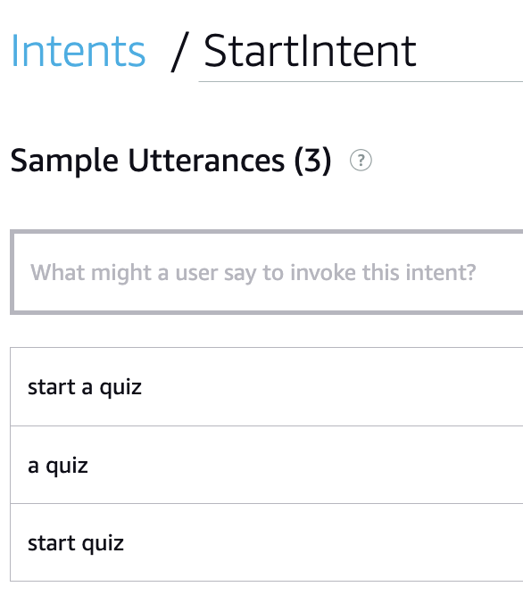

## 5. Explore AnswerIntent with Slots

1. In the "Build" tab under "Interaction Model" section, click on the "Intents" link.
2. Locate the "AnswerIntent" and open it.
3. Examine the existing utterances and note that they have a specific place holders that are called "Slots" (`{answer}` and `{city}`)
4. In the **"Intent Slots"** section below you can see that these slots have specific slot types assigned, which helps Alexa to route the user response to this specific Intent.
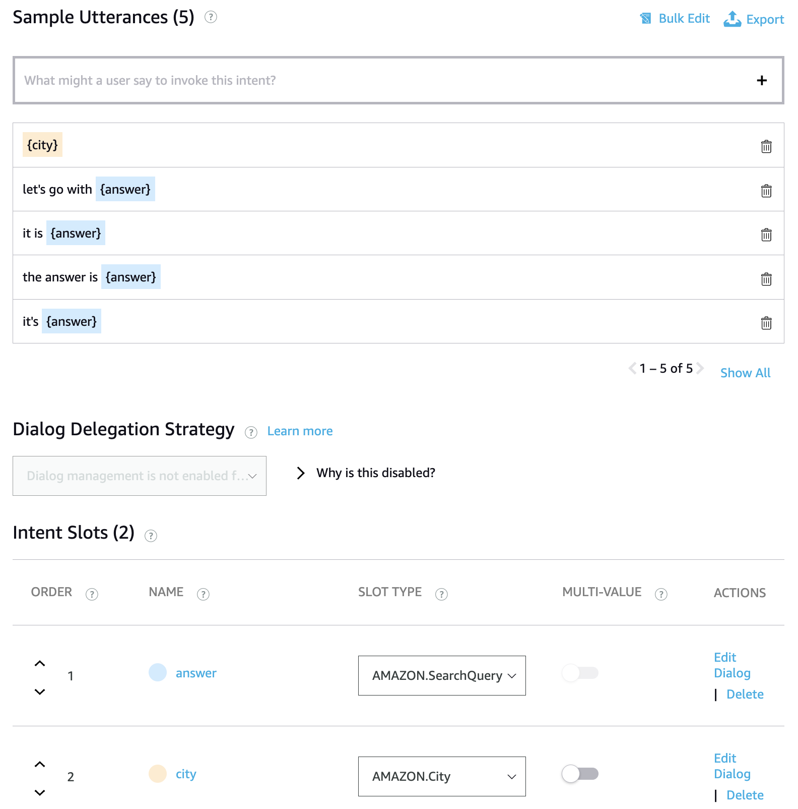
5. You can experiment with existing utterances or by adding a new ones and test them by clicking **"Evaluate Model"** button on the top.
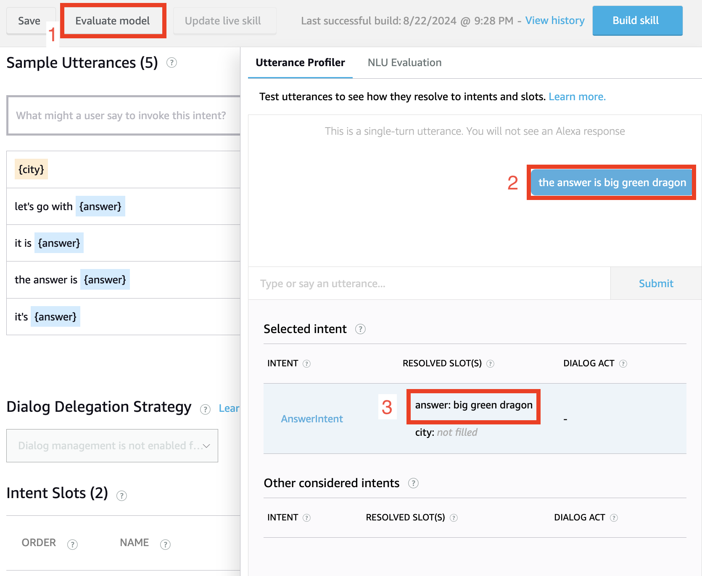
3. Click "Save Model" and then "Build Model", wait for deployment.
4. Go back to "Test" tab and check if it works.

## 6. Explore the quiz contents

1. Switch to the "Code" view in the Alexa Skills Console.
2. Explore the `flashcards.json` file under `lambda` directory.
3. Change or add some questions or answers.
1. After making the changes, click on the "Save" button to save your code.
2. Click on the "Deploy" button to deploy your code to the Alexa platform and wait for deployment to finish.
3. Go back to "Test" tab and check if it works.

## 7. Possible Improvements

After successfully creating and testing your first custom Alexa skill, you may want to consider adding some improvements to enhance the user experience. Here are a few suggestions:

### 1. Display Current Score

Modify the code to make Alexa respond with the current score before reading the next question. This will help users keep track of their progress during the quiz.

To implement this feature, you can update the `AnswerIntentHandler` class in `lambda_function.py` to include the current score in the response before asking the next question. You can store the current score and number of already asked questions int `attr` variable.

### 2. Enable Hint Functionality

Enhance the skill by allowing users to request a hint for the current question. This can be particularly useful for challenging questions or when users are stuck.

To implement this feature, you can create a new intent (e.g., `HintIntent`) in the Interaction Model and handle it in your code. Within the `HintIntentHandler` class in `lambda_function.py`, you can provide a relevant hint based on the current question or flashcard.


These are just a few examples of possible improvements you could consider. Feel free to explore other enhancements, such as adding more flashcard categories, implementing a leaderboard system, or integrating with external APIs to fetch additional information. Remember to refer to the official Alexa Skills Kit documentation for more advanced features and customizations.

## 8. Adding a new handler for your skill
1. When you decide to add a new intent (for example to support hint functionality) you will need to add a HintIntent with respective utterances (such as "I need a hint", etc.).
2. Next step will be to add the `HintIntentHandler` class inside the `lambda_function.py` code file. Similarly to other intent handler classes (remember to implement `can_handle` and `handle` methods).
3. At last you need to register the newly created handler into the SkillBuilder object on the bottom of the `lambda_function.py` file.
```python
sb.add_request_handler(HintIntentHandler())
```

## 9. Debugging with CloudWatch Logs

If you encounter any issues while testing your skill after code changes, you can access the CloudWatch logs for debugging purposes.

1. In the Alexa Skills Console, navigate to the "Code" view.
2. Click on the "Logs" button to open the CloudWatch logs for your skill.
3. Here, you can view the logs and identify any errors or issues that may have occurred during the execution of your skill.